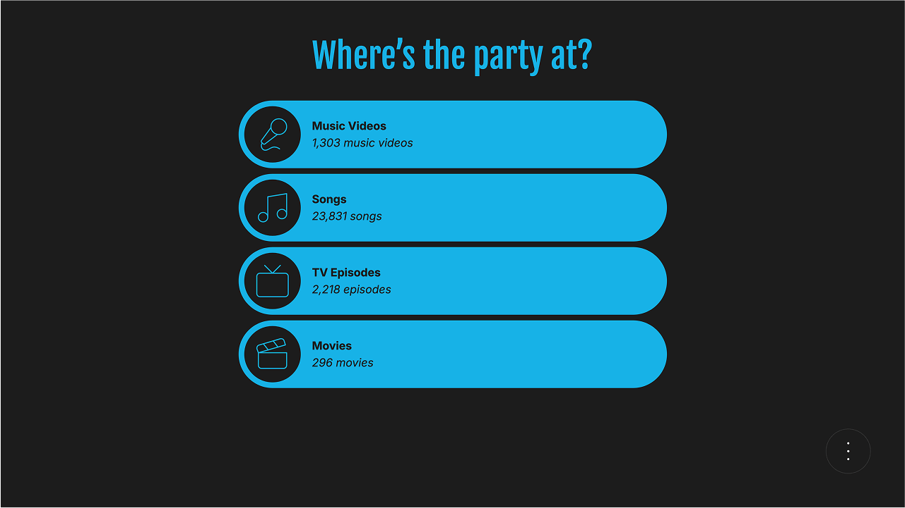
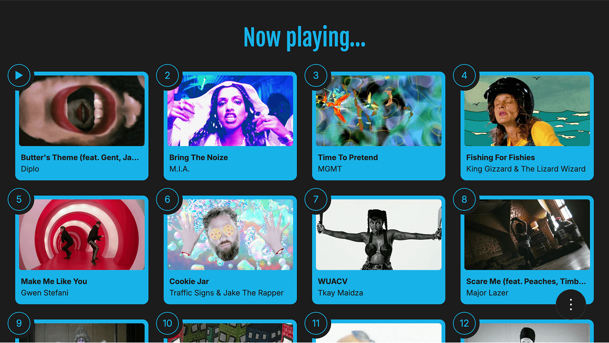
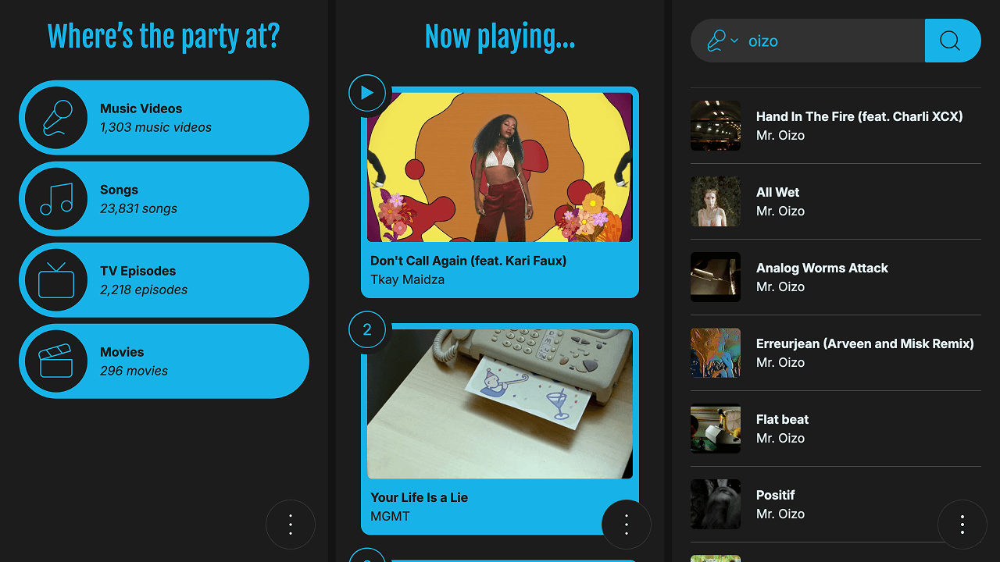
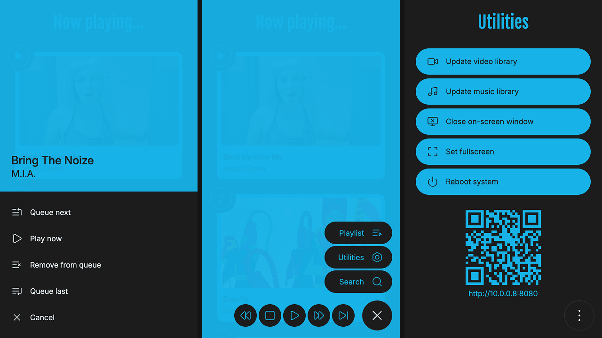

# PartyMode Web Interface for Kodi

PartyMode is a Kodi web interface dedicated to keeping the party going. Share a simple, mobile-friendly interface with friends on your network to collaboratively build and control playlists of music videos, songs, TV episodes or movies.

## Features

- Instant party mode for music videos and songs
- Random playlists for TV episodes and movies
- Simple, mobile-first design optimized for touch devices
- Search and queue content from your entire media library
- Share access URL via QR code for easy device connection

## Screenshots

_Homepage_

_Now Playing_

_Homepage, Now Playing & Search on mobile_

_Context Menu, Main Menu & Utilities on mobile_

## Prerequisites

- Kodi 19.0 (Matrix) or later
- Network connection between your device and Kodi
- Modern web browser (Chrome, Firefox, Safari, Edge)

## Installation

1. **Download and install**
   - Download `webinterface.partymode-x.x.x.zip` from [Releases](https://github.com/oddmouse/partymode/releases/latest)
   - In Kodi: **Settings** → **Add-ons** → **Install from zip file**
   - Select the downloaded zip file

2. **Enable web interface**
   - Go to **Settings** → **Services** → **Control**
   - Enable **Allow remote control via HTTP**
   - Enable **Allow remote control from applications on other systems** (required for web sockets)
   - Set username/password (recommended)
   - Set **Web interface** to **PartyMode**

3. **Access**
   - Get your Kodi IP: **Settings** → **System Info** → **Network**
   - Open browser to `http://your-kodi-ip:8080`

## Contributing

Contributions are welcome! Please feel free to submit a Pull Request. For major changes, please open an issue first to discuss what you would like to change.

## Acknowledgments

- [Easings](https://easings.net) - Animation easing functions
- [Fjalla One Font](https://github.com/SorkinType/FjallaOne) - Display typography
- [Inter Font](https://github.com/rsms/inter) - Interface typography
- [Kodi](https://kodi.tv) - The amazing media center platform
- [Lucide Icons](https://lucide.dev) - Beautiful icon set
- [QR Code Encoder](https://github.com/nimiq/qr-creator) - QR code generation
- [Test Card](https://en.wikipedia.org/wiki/Test_card) - Test pattern image

## License

This project is licensed under the GNU General Public License v2.0 or later - see the [LICENSE](public/LICENSE.txt) file for details.